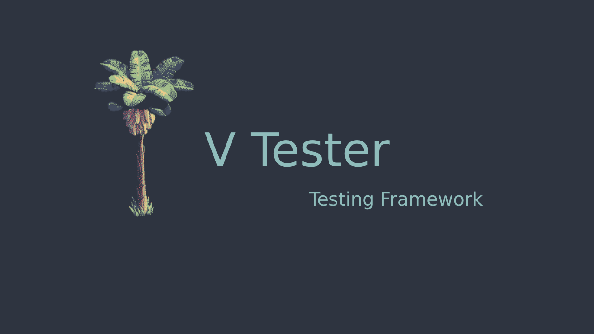

# VTester

**VTester** is a testing Appilcation that can be used to write and evaluate Unit tests.<br>
Currently supported languages are C and Python.
Tests are written in VazhaScript DSL.
<br><br>



<br><br>

## Current Features
- Tauri GUI with React Ts frontend
- Run and evaluate unit Tests
- Write tests in VazhaScript DLS , provide test info, compiler info (currently supported : GCC ,Clang),add tests.
- Run test locally and evaluate result.

## Installation
- clone the repo<br>

Run the package in testing

```bash
cargo test
```
Build Dev package
```bash
yarn tauri dev
```
Build binary

```bash
yarn tauri build
```

## To-dos
- Integrate with server,fetch and evaluate remote tests.
- Add Authentication .
- Inprove UI.
- Improve VazhaScript syntax.
- Result Dashboard.
- Add Docker support.
- Add TUI support : ) .

